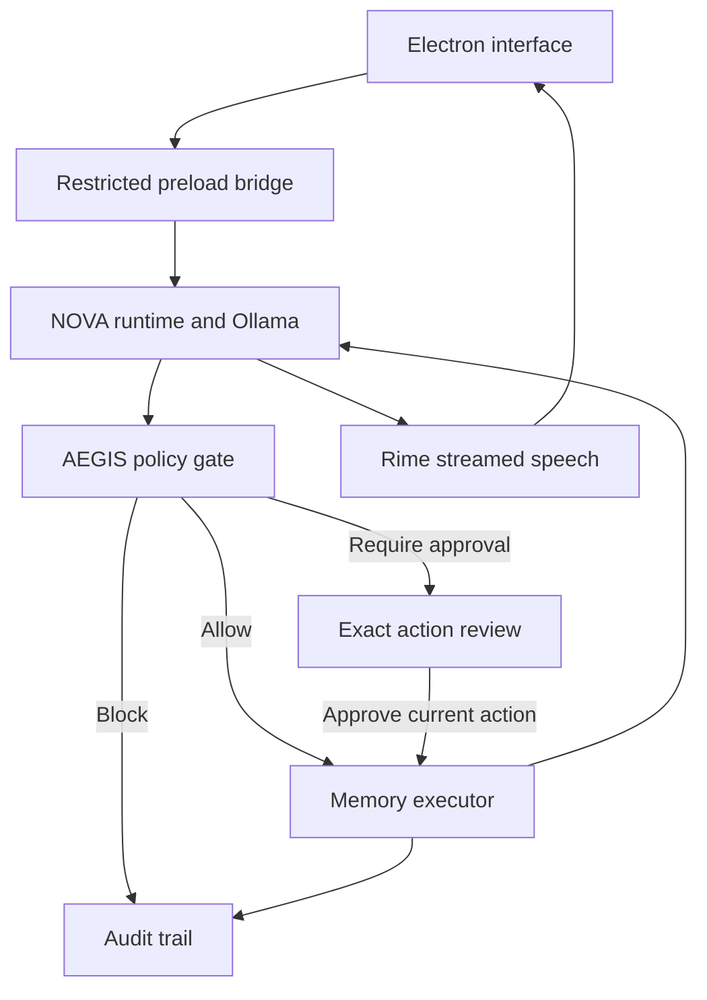

# NOVA × AEGIS

A voice-first Electron workspace for a hands-busy researcher who wants to recall project context, change direction mid-answer, and capture new ideas without silently granting an agent unrestricted access.

NOVA uses your Ollama model to converse and propose typed memory actions. AEGIS authorizes those actions independently. Rime provides the desktop app's primary spoken responses. A responsive browser demo uses the same interface and policy/runtime code with explicitly simulated providers.

## What is implemented

- Electron main/preload/renderer separation, sandboxed renderer, context isolation, a narrow IPC bridge, navigation restrictions, and audio-only microphone permissions.
- Local Ollama `/api/chat` reasoning with JSON actions. Qwen model name configurable; default `qwen3:8b`.
- AEGIS: read-only memory search, exact-action approval for save, blocked deletion and unknown tools. Approval expires after 120 seconds, is consumed once, and is invalidated by a new turn.
- Persistent desktop memories and JSONL audit under Electron's userData directory. Browser demo state is intentionally session-only.
- Interactive knowledge graph, memory inspector, task history/export, policies, provider settings, particle orb, and voice studio.
- Continuous microphone capture with energy-based VAD, local whisper.cpp transcription, abortable Ollama and Rime requests, turn fencing, streamed PCM playback, interruption, and full-response playback acknowledgements.
- An automated stale-result stress fixture, unit/integration-contract tests, a live provider preflight, and an acoustic measurement helper.

This is a runnable source project, not a signed installer or a completed hackathon submission. Live Rime synthesis, local Qwen behavior, microphone operation, and acoustic acceptance have not been verified in the build environment. No live provider credentials were available. See RIME_EVIDENCE.md.

## Quick start — desktop

Use Node.js 22.16+ or 24 LTS, npm, Ollama, and a local whisper.cpp server. On Windows, use the equivalent copy command for `.env` and the built `.exe` paths for whisper.cpp.

```sh
npm ci
cp .env.example .env
ollama pull qwen3:8b
```

Start Ollama if it is not already running:

```sh
ollama serve
```

Edit `.env` locally. Set `RIME_API_KEY` to your key, and set `OLLAMA_MODEL` to an installed Qwen model if different. Never put your key in the renderer or commit `.env`. The main process reads `.env` from the directory from which the app is launched. Packaged-app users can supply environment variables before launch; connection preferences except secrets are also editable in the app.

Start a whisper.cpp server on loopback. From a whisper.cpp checkout after downloading/building its model and server:

```sh
./build/bin/whisper-server -m models/ggml-base.en.bin --host 127.0.0.1 --port 8178
```

The renderer converts microphone input to mono 16-bit PCM WAV at 16 kHz. The main process posts it as multipart `file` to `http://127.0.0.1:8178/inference`. The default recognition setup is English. Other Rime languages do not automatically install compatible recognition models.

Then, from this project:

```sh
npm run preflight
npm start
```

In Connections, check providers and choose the installed model. Click Start session and permit microphone access. Use headphones. Ask “Search my memory for voice”, interrupt with “Wait, search for AEGIS instead”, and inspect Task history. Ask NOVA to remember a new idea; review the exact text in the AEGIS approval dialog before saving.

If Rime is unavailable, text remains visible and the active provider badge reports the failure. The desktop app never silently substitutes browser speech. Without whisper.cpp, typed input remains available. The web demo offers an explicit, labeled browser speech fallback; it is not the judged Rime path. Browser SpeechRecognition may use a browser-vendor network service.

## Exact default Rime configuration

| Field | Value |
|---|---|
| Model | `coda` |
| Speaker | `astra` |
| Language | `en` (catalog group `eng`) |
| Endpoint | `https://users.rime.ai/v1/rime-tts` |
| Region | Default routing at users.rime.ai; not a pinned regional deployment |
| Accept | `audio/L16` |
| Audio | Signed 16-bit little-endian PCM, mono, 24,000 Hz |
| Transport | Streaming HTTPS fetch in Electron main; byte chunks via IPC; Web Audio playback |
| Authentication | Bearer token in main-process environment only |
| Catalog | `https://users.rime.ai/data/voices/all-v2.json` |

These defaults match the official Coda HTTP and catalog documentation consulted on 2026-09-07. The live catalog could not be fetched from the build environment. `npm run preflight` revalidates the exact model/speaker/language tuple, synthesizes a real clip, and confirms the selected Ollama model. It is a project check, not the organizer's separate preflight.

## Architecture



`core/runtime.mjs` owns turn identity and cancellation. No model-supplied action can invoke arbitrary shell commands, files, browsers, network tools, or database operations. The only executor handles NOVA's memory records. The main process owns disk access and provider requests; the renderer never sees a Rime key. Memory notes are reference data, not policy authority.

Microphone speech onset stops local playback immediately, cancels provider requests, invalidates approvals, and advances the turn fence. Transcription of the updated utterance starts a new request. Outdated model/tool/audio results cannot be emitted as current by the runtime. A completed local write is not undone by interruption; the audit and memory inspector are the source of truth. There are no automatic retries for writes.

Microphone input continues during TTS and tool work. VAD is an energy threshold, not a trained diarization or echo-cancellation model. Browser echo cancellation is requested, but loudspeaker echo can still trigger false interruptions. Use headphones and run the real acceptance procedure.

## Test and package

```sh
npm test
npm run package
npm run dist
```

The first command checks governance, provider request contracts, cancellation fences, and PCM handling without live services. `package` produces an unpacked app for the host OS under `release`; `dist` creates its installer target. Build on each intended platform. macOS signing/notarization and Windows code signing are not configured.

## Repository map

- `desktop/main.cjs`: local providers, IPC validation, persistence, permissions.
- `desktop/preload.cjs`: explicit renderer-facing methods.
- `core/policy.mjs`: action checks, approval snapshots, turn fences.
- `core/runtime.mjs`: task orchestration, execution, speech events, audit.
- `core/providers.mjs`: Ollama, Rime streaming, live catalog, local STT.
- `dist/`: self-contained shared UI and browser demo.
- `dist/lib/`: exact copies of policy/runtime for the browser demo; `npm test` checks parity.
- `tests/`: automated checks.
- `scripts/preflight.mjs`: real Rime synthesis/catalog and Ollama check.
- `scripts/measure-interruption.py`: loopback WAV silence measurement.
- `RIME_EVIDENCE.md`: acceptance method, results, limitations.
- `DEMO_SCRIPT.md`: recording outline, normal and failure cases.

## Data and limitations

- Desktop memory is local JSON, not a vector database or learned graph. Starter links are explicit; newly approved notes attach visually to the workspace. Search is case-insensitive substring matching. No document ingestion or arbitrary file management is claimed.
- Audit logs contain task content and memory text. They are local and not tamper-proof or encrypted. Do not enter secrets into demo content. Raw microphone audio is transient; the app does not archive it.
- Rime receives response text over its cloud endpoint. Local Ollama and local STT do not make the whole application offline.
- Model replies use buffered JSON for reliable action parsing; audio then streams. This is not a token-streaming LLM frontend or an optimized low-latency pipeline.
- Playback acknowledgements mean the local audio queue completed, not that the person heard or understood every word. Partial word-level history reconciliation is not implemented; interrupted turns are explicitly marked as potentially unheard.
- The UI response timer begins after a request is submitted and excludes STT; it is not an acoustic end-to-end metric.
- No automatic multilingual routing, telephony, pronunciation benchmark, provider comparison benchmark, cloud account synchronization, or external computer-control tools. These are optional challenge directions, not requirements all implemented here.
- No real voice performance numbers, recorded demo, organizer preflight, or signed installers are included. They require the configured target machine and accounts.

## Primary references

- [Rime Coda HTTP API](https://docs.rime.ai/api-reference/coda/http)
- [Rime live voice catalog schema](https://docs.rime.ai/api-reference/data/voices-v2)
- [Rime project catalog](https://github.com/rimelabs/rime-dev-projects) — linked by the supplied brief; unavailable to inspect from this build environment. Review before submission.
- [Ollama chat API](https://docs.ollama.com/api/chat)
- [Ollama structured output](https://docs.ollama.com/capabilities/structured-outputs)
- [whisper.cpp server](https://github.com/ggml-org/whisper.cpp/tree/master/examples/server)
- [Electron security](https://www.electronjs.org/docs/latest/tutorial/security)
